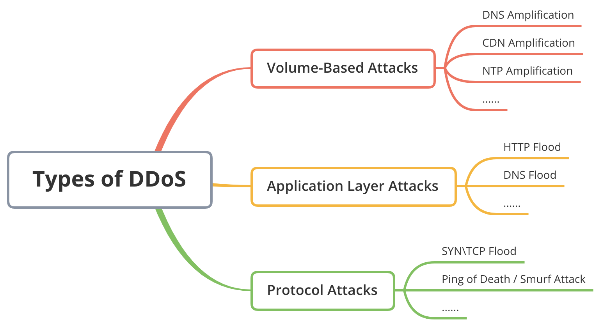

# An overview of DDoS
An overview of DDoS, including Volume-Based Attacks, Application Attacks, Protocol Attacks. With corresponding real-world incidents.

# Types of DDoS

## 1. Volume-Based DDoS

## 2. Application DDoS

### 2.1. DNS Flood

## 3. Protocol Attacks

# Defend DDoS

# License  
This project is licensed under the MIT License - see the [LICENSE](LICENSE) file for details.  
If you want to cooperate or use this project, please contact the author: wangchi.work@gmail.com
